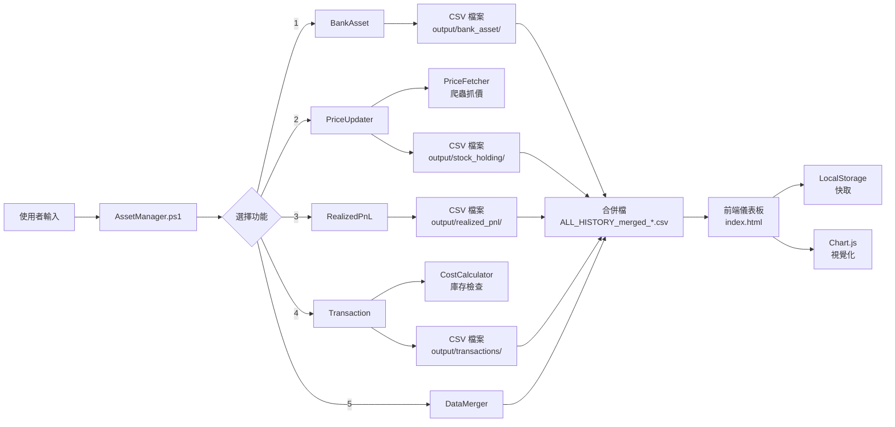

# 個人資產視覺化系統 - 完整技術文件

## 📋 系統概述

這是一個採用 **前後端分離架構** 的個人資產管理與投資組合追蹤系統，專為繁體中文 Windows 環境設計。系統透過 PowerShell 進行資料管理與自動化處理，並以現代化 HTML/JavaScript 前端提供互動式視覺化分析。

### 🎯 核心特點

#### 技術架構
- **後端引擎**: PowerShell 5.1+ (原生 Windows 支援，零依賴安裝)
- **前端介面**: 原生 JavaScript (ES6+) + Chart.js 視覺化
- **資料格式**: CSV (UTF-16 LE) - 完全相容 Excel/Power BI
- **儲存機制**: LocalStorage (前端自動快取)

#### 核心功能
1. **多幣別交易追蹤** - 支援台股/美股/港股/ETF，自動匯率處理
2. **FIFO 成本計算** - 精確的批次成本追蹤與損益計算
3. **即時股價更新** - 整合 Yahoo Finance API
4. **歷史回溯分析** - 時間點資產快照與趨勢分析
5. **智慧費用試算** - 自動計算手續費與交易稅
6. **庫存管理** - 即時庫存檢查與超賣預警

---

## 🏗️ 系統架構

### 後端模組 (PowerShell)

```
AssetManager.ps1 (主程式入口)
├── common.ps1 (共用函數庫)
│   ├── Get-Config          - 設定檔載入
│   ├── Write-Log           - 日誌記錄系統
│   ├── Get-CleanInput      - 使用者輸入處理
│   ├── Export-DataToCsv    - CSV 匯出引擎
│   ├── Load-StockList      - 股票清單管理
│   └── Select-Stock        - 互動式股票選擇
│
└── modules/
    ├── BankAsset.ps1       - 銀行資產錄入
    ├── Transaction.ps1     - 交易明細錄入 (買賣單管理)
    ├── CostCalculator.ps1  - 成本計算引擎 (FIFO 演算法)
    │   ├── Get-TransactionData      - 交易資料載入
    │   ├── Get-PortfolioStatus      - 即時持倉計算
    │   └── Get-PnLReport            - 損益報表生成
    ├── PriceFetcher.ps1    - 股價爬蟲 (Yahoo Finance)
    ├── PriceUpdater.ps1    - 市值更新引擎
    ├── RealizedPnL.ps1     - 已實現損益錄入
    └── DataMerger.ps1      - 歷史資料合併工具
```

### 前端模組 (JavaScript)

```
index.html (視覺化儀表板)
├── js/
│   ├── main.js             - 程式進入點與事件綁定
│   ├── core/
│   │   ├── init.js         - Namespace 初始化
│   │   ├── utils.js        - 工具函數 (格式化/動畫/拖放)
│   │   └── data.js         - 資料管理層 (CSV 解析/LocalStorage)
│   └── modules/
│       ├── bank.js         - 銀行資產視覺化
│       ├── stock.js        - 股票庫存視覺化 (含多圖表切換)
│       ├── pnl.js          - 損益分析視覺化
│       └── history.js      - 交易歷史表格渲染
```

---

## 🔧 核心功能詳解

### 1. 交易錄入系統 (Transaction.ps1)

**功能亮點**:
- ✅ **智慧股票選擇** - 支援代號/名稱搜尋或列表選擇
- ✅ **多幣別支援** - 自動識別市場幣別 (TWD/USD/HKD)
- ✅ **即時庫存檢查** - 賣出前自動驗證庫存數量，防止超賣
- ✅ **費用自動試算** - 依設定檔計算手續費與交易稅
- ✅ **雙幣別記錄** - 同時記錄原幣與台幣交割金額

**輸入欄位**:
```
- 交易日期 (YYYYMMDD)
- 股票代號/名稱 (支援搜尋)
- 交易類別 (買入/賣出)
- 成交價格 (原幣)
- 股數
- 幣別 (自動判定，可修正)
- 匯率 (外幣必填)
- 手續費/交易稅 (自動試算，可修正)
- 交割金額 (台幣) (自動計算，可修正)
```

**資料輸出範例**:
```csv
日期,代號,名稱,類別,股數,買入價,賣出價,手續費,交易稅,總金額,幣別,匯率,交割金額(台幣),備註
2026/01/15,2330,台積電,買入,10,1050,,,20,0,10520,TWD,1,10520,定期定額
```

---

### 2. 成本計算引擎 (CostCalculator.ps1)

**核心演算法**: FIFO (先進先出)

**功能模組**:

#### `Get-PortfolioStatus` - 即時持倉計算
- 讀取指定日期前的所有交易記錄
- 採用 **FIFO 批次追蹤**:
  - 每筆買入建立獨立批次 (Batch)
  - 賣出時從最早批次開始沖銷
  - 記錄每批次的原幣成本與台幣成本
- 計算平均成本 (原幣 + 台幣)
- 累計已實現損益

#### `Get-PnLReport` - 損益報表生成
- 生成指定年度或全期間的損益明細
- 每筆賣出紀錄包含:
  - 日期、市場、股票代號/名稱
  - 幣別與匯率
  - 賣出股數
  - 成本 (原幣 + 台幣，依 FIFO 沖銷結果)
  - 賣出金額 (原幣 + 台幣)
  - 已實現損益 (原幣 + 台幣)
  - 報酬率 (%)

**資料結構**:
```powershell
# Portfolio Object
$portfolio[$code] = @{
    Name          = "股票名稱"
    Type          = "市場類別"
    Currency      = "幣別"
    Quantity      = 100              # 目前持股數
    AvgCostOrig   = 150.5            # 平均成本 (原幣)
    AvgCostTWD    = 4800             # 平均成本 (台幣)
    TotalCostOrig = 15050            # 總成本 (原幣)
    TotalCostTWD  = 480000           # 總成本 (台幣)
    RealizedPnL   = 5000             # 已實現損益
    Batches       = Queue[...]       # FIFO 批次佇列
}
```

---

### 3. 股價更新系統 (PriceFetcher.ps1 + PriceUpdater.ps1)

**功能流程**:
1. **PriceFetcher** - 爬蟲引擎
   - 目標網站: Yahoo Finance (台股/美股/港股/ETF)
   - 抓取即時/收盤價
   - 錯誤處理: 自動跳過失敗項目

2. **PriceUpdater** - 市值計算
   - 讀取最新交易紀錄計算持倉
   - 套用最新股價計算市值
   - 計算未實現損益與報酬率
   - 生成完整持股報表

**輸出格式**:
```csv
日期,代號,名稱,類別,股數,平均成本(原幣),總成本(原幣),總成本(台幣),目前股價,市值(原幣),市值(台幣),未實現損益(台幣),報酬率(%),幣別,最新匯率
20260131,AAPL,蘋果,美股,20,230.5,4610,147520,235.8,4716,150912,3392,2.3,USD,32
```

---

### 4. 資料合併工具 (DataMerger.ps1)

**功能**: 將多個單日 CSV 檔案合併為完整歷史資料

**使用時機**:
- 前端需要歷史趨勢圖 (必須合併)
- 需要跨日期分析
- 準備匯入 Power BI 或其他分析工具

**合併邏輯**:
- 讀取 `output/*/YYYYMMDD_*.csv`
- 依日期排序
- 移除重複紀錄
- 輸出 `output/ALL_HISTORY_merged_*.csv`

---

### 5. 前端視覺化系統

#### 資料管理 (data.js)
- **CSV 解析**: 使用 PapaParse 處理 UTF-16 LE
- **自動辨識**: 依檔名或欄位自動分類資料類型
- **快取機制**: LocalStorage 自動儲存，重整不遺失
- **批次上傳**: 支援拖放多檔案同時載入

#### 圖表系統 (Chart.js)
**銀行資產**:
- 總資產卡片 (含 Sparkline 迷你走勢圖)
- 帳戶分佈圓餅圖 (含百分比標籤)
- 資產趨勢折線圖
- 帳戶明細表格

**股票庫存**:
- 總市值/未實現損益卡片
- 持股分佈 (圓餅圖/長條圖/氣泡圖 三種切換)
- 持股明細表 (含損益著色 - 漲紅跌綠)
- 外幣資產顯示原幣金額

**已實現損益**:
- 總損益/總賣出/總成本統計
- 盈虧分佈圓餅圖
- 交易明細表 (可依日期篩選)

**交易歷史**:
- 完整流水帳表格
- 買賣標記 (買入/賣出 顏色區分)

---

## 📊 資料流程



---

## ⚙️ 設定檔說明

### config.json
```json
{
    "OutputDirectory": "output",
    "Logging": {
        "Level": "Info",
        "LogFile": "logs/app.log"
    },
    "Defaults": {
        "DateFormat": "yyyyMMdd",
        "CsvEncoding": "Unicode"
    },
    "Transaction": {
        "FeeRate": 0.001425,    // 手續費率 0.1425%
        "TaxRate": 0.003,       // 證交稅率 0.3%
        "MinFee": 20            // 最低手續費 20 元
    }
}
```

### account_list.txt
```
台銀
富邦
國泰世華
```

### stock_list.txt
```
台股,2330,台積電
台股,2317,鴻海
ETF,00878,國泰永續高股息
美股,AAPL,蘋果
港股,0700,騰訊
```

---

## 🚀 快速開始

### 1. 環境需求
- Windows 10/11
- PowerShell 5.1+
- 現代瀏覽器 (Chrome/Edge/Firefox)

### 2. 初次設定
```powershell
# 1. 開啟 PowerShell 執行權限
Set-ExecutionPolicy RemoteSigned

# 2. 編輯設定檔
notepad account_list.txt
notepad stock_list.txt

# 3. 啟動主程式
.\AssetManager.ps1
```

### 3. 主選單功能
```
1. 銀行資產輸入      → 記錄各帳戶餘額
2. 更新股價與市值    → 自動抓取最新股價並計算市值
3. 已實現損益輸入    → (已棄用，建議改用功能 4)
4. 錄入交易明細      → ★ 推薦：記錄買賣單，系統自動計算成本
5. 合併年度資料      → ★ 必須：生成完整歷史檔供前端使用
6. 刪除交易紀錄      → 修正錯誤紀錄
```

### 4. 查看視覺化報表
1. 執行「合併年度資料」(功能 5)
2. 開啟 `index.html`
3. 拖放 `output/ALL_HISTORY_merged_*.csv` 至網頁
4. 切換分頁查看各項報表

---

## 💡 進階使用

### 多幣別交易範例
```
# 美股買入
日期: 20260115
股票: AAPL (蘋果)
類別: 買入
價格: 230.5 USD
股數: 10
匯率: 32.0
→ 系統自動計算:
  - 小計: 2305 USD
  - 手續費: 20 USD (低消)
  - 總成交: 2325 USD
  - 台幣交割: 74400 TWD
```

### 賣出庫存檢查
```
# 系統自動檢查
🔍 正在檢查庫存...
   目前庫存: 10 股
   賣出數量: 15 股
❌ 庫存不足！無法賣出 (缺少 5 股)
```

### 成本計算範例
```
# FIFO 批次追蹤
買入記錄:
  2026/01/10: 10 股 @ 230 USD (批次 1)
  2026/01/20: 5 股 @ 240 USD (批次 2)

賣出記錄:
  2026/01/25: 12 股 @ 250 USD
  → 沖銷批次 1: 10 股 @ 230 USD (成本 2300)
  → 沖銷批次 2: 2 股 @ 240 USD (成本 480)
  → 總成本: 2780 USD
  → 總收入: 3000 USD
  → 損益: +220 USD
```

---

## 📌 常見問題

### Q: 執行腳本時出現「禁止執行指令碼」?
```powershell
# 以管理員身分執行
Set-ExecutionPolicy RemoteSigned
```

### Q: 前端日期選單是空的?
請確認已執行「合併年度資料」(功能 5)，並上傳 `merged` 檔案。

### Q: 股價更新失敗?
- 檢查網路連線
- 確認股票代號正確 (台股不需 .TW 後綴)
- Yahoo Finance 可能暫時無法存取，稍後重試

### Q: 顯示亂碼?
- 確認 CSV 使用 Unicode (UTF-16 LE) 編碼
- PowerShell 已自動處理，無需手動轉換

---

## 🛠️ 技術規範

### PowerShell 開發規範
- 遵循 Open-Closed Principle (開放封閉原則)
- 共用函數統一放置 `common.ps1`
- 模組化設計，新功能透過注入方式擴充
- 繁體中文註解與日誌
- Unicode (UTF-16 LE) 檔案編碼

### 前端開發規範
- 原生 JavaScript (避免框架依賴)
- Namespace 模組化架構 (`App.*`)
- 相容 `file://` 協定 (無需伺服器)
- LocalStorage 資料持久化
- 響應式設計 (支援行動裝置)

---

## 📝 更新日誌

- **2026-01-31**: 完整重寫技術文件，新增系統架構與核心演算法說明
- **2026-01-30**: 前端架構重構 (Modularization)；新增 LocalStorage、Sparklines、拖放上傳
- **2026-01-29**: 新增交易錄入、股價爬蟲、成本計算功能
- **2026-01-27**: 修正多幣別成本計算邏輯，新增外幣原幣顯示
- **2026-01-26**: 重構為 PowerShell 版本；新增日期篩選功能

---

## 📄 授權與支援

本專案為個人資產管理工具，僅供學習與個人使用。
如有技術問題，請參考程式碼註解或聯繫開發者。
